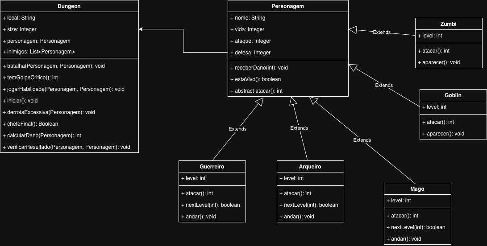

# orpgmaisdificildomundo

## Este projeto tem como objetivo fixar os conhecimentos em Java em consonância ao paradigma de orientação a objetos.

### Participantes desse projeto:
* Raphael Barbosa Félix Filho
* João Moura Brandão

### Regras
* Ambos poderão se ajudar na completude do projeto, porém cada um deles fará o seu próprio projeto.
* Será terminantemente proibido utilizar qualquer ferramenta de IA para gerar código.
* Todas as dúvidas do projeto devem ser endereçadas via whatsapp/discord ou podem ser tiradas em foruns ou no google.
* Será utilizado versionamento de código e todo o projeto será publicado no github de cada participante.

### Como iniciar o projeto
Este projeto deverá seguir as indicações por vídeo, publicado no link: 

### O projeto
O projeto consiste em desenvolver uma versão inicial de um rpg, o intuito é que se trate do rpg mais difícil do mundo.
Os desenvolvedores terão a disposição um diagrama de classes UML que estará disponível a seguir:

No diagrama UML acima, pode ser visto as classes e como as mesmas se interconectam.
Os atributos *DEVEM* estar encapsulados e qualquer acesso aos mesmos deve ser realizados via métodos get e set.

### Funcionalidades do projeto
É esperado que um personagem consiga completar uma dungeon com sucesso ou não. 
Para tal, uma série de métodos devem ser desenvolvidos para ajudar na completude do objetivo.

#### Personagem
* `void receberDano(dano)`
  - Consiste em receber um dano do inimigo e modificar o valor de vida de acordo com o dano recebido.

* `boolean estaVivo()`
  - Consiste em verificar se o personagem (ou inimigo) está vivo.

* `abstract int atacar()`
  - Consiste no ataque do personagem (ou inimigo) fará contra seu adversário.

#### Guerreiro, Mago ou Arqueiro
Cada classe, deverá ter os seguintes status iniciais:
* Guerreiro: 120 de vida, 15 de ataque e 15 de defesa, porém só anda uma casa por vez.
* Arqueiro: 100 de vida, 10 de ataque e 10 de defesa, anda duas casas por vez.
* Mago: 200 de vida, 5 de ataque e 20 de defesa, anda duas casas por vez.

Todos deverão iniciar com nível 1 e deve subir de nível a cada dois inimigos finalizados. Para cada nível, deve ser 
acrescido 10 pontos de vida, 2 pontos de ataque e defesa
O nome de cada um dos personagens deverá ser gerado de forma aleatória utilizando a biblioteca faker, um guia básico
pode ser visto em: 

* `int atacar()`
  - Consiste em realizar a ação de ataque, buscando o valor de ataque de cada classe e atribuindo dano.
Deverá ser escolhido aleatoriamente um número **entre 1 e 20**, caso o valor seja **menor ou igual a 2**, 
serão atribuídos apenas 30% da quantidade de ataque original (arredondados para baixo).
Caso o valor seja entre 3 e 12 (inclusos), deverá ser atribuído 50% dos pontos de ataque originais arredondado para baixo.
Caso o valor seja entre 13 e 16 (inclusos), deverá ser atribuído 80% dos pontos de ataque originais arrendondado para baixo.
Caso o valor seja entre 17 e 19, deverá ser atribuído o valor original dos pontos de ataque.
Caso o valor seja exatamente 20, deverá ser atribuído o dobro do dano original.

Para os casos de Mago e Arqueiro, temos regras especiais, para tal:
* Mago 
  - Não há redução de dano
  - Caso o valor seja entre 15 e 19, o dano dado será o dobro da quantidade original
  - Caso o valor seja 20, o dano dado será o triplo da quantidade original

* Arqueiro
  - Há redução de dano em 70% se o valor for igual ou inferior a 5.
  - Não há redução de dano caso o valor esteja entre 6 e 14 (inclusos)
  - Caso o valor seja entre 15 e 19 (inclusos), o dano dado deverá ser o dobro da quantidade original
  - Caso o valor seja 20, o dano dado será duas vezes e meia maior que o dano original.

* `int nextLevel(int)`
  - Consiste em aumentar em um o nível dos personagens.

* `void andar()`
  - Diminui na quantidade de passos de cada classe, o tamanho da dungeon

#### Zumbi ou Goblin
Para as classes de Zumbi e Goblin, ambos tem ataque, vida e defesa de 20, 10 e 10 respectivamente. E seus comportamentos serão:

* `int atacar()`
  - Consiste em realizar a ação de ataque e deverá ser escolhido aleatoriamente um valor entre 1 e 20, caso o valor seja
maior que 10, o dano atribuído deverá ser dobrado. Caso o valor seja igual a 20, o dano deverá ser triplicado.

* `void aparecer()`
  - Consiste na chance do personagem inimigo aparecer e ocorrer uma batalha. Caso o personagem escolhido seja um Mago ou um Arqueiro
o inimigo **sempre** aparecerá, caso seja um Guerreiro, deverá ser escolhido aleatoriamente um número entre 1 e 4 
onde se o valor for 1, o inimigo aparecerá e ocorrerá uma batalha.

#### Dungeon
Para a classe Dungeon, temos as seguintes limitações:

- O atributo size, não pode ser superior a 10 e nem inferior a 8. E não pode jamais ser inferior a 1
- O atributo local deve ser escolhido aleatoriamente usando a biblioteca faker. 
- Apenas um Personagem mocinho deve ser escolhido, porém os inimigos **DEVEM** ser mais que 1, onde não pode ser 
superior a metade do tamanho da dungeon (arredondado para cima).
- Quando houver **APENAS** um inimigo e o tamanho da dungeon for igual a 1, seus status deverão ser triplicados.

* `void batalha(Personagem p1, Personagem p2)`
  * Ocorre quando o personagem p2 aparecer e finaliza quando apenas um estiver vivo.
  * A ordem de ataque é sempre p1 atacando primeiro e em seguida p2, caso ambos permaneçam vivos, eles atacam novamente na mesma ordem.
  * Para cada ataque, verifica a possibilidade de haver golpe crítico de acordo com a regra de cada classe.
  * Para cada ataque bem sucedido, deverá haver o cálculo do dano para o personagem defensor.
  * Quando um dos personagens morrer, deverá ser verificado o resultado, caso o p1 seja bem sucedido, o tamanho da 
  dungeon diminui em 1 e a lista de inimigos diminui em 1 também. Caso o p2 seja bem sucedido, o jogo finaliza.

* `int temGolpeCritico()`
  * Verifica se há golpe crítico de acordo com as regras de cada classe

* `void jogarHabilidade(Personagem, Personagem)`
  * Este método tem como intuito a possibilidade de jogar uma skill que dê dano direto ao inimigo, os estudantes imaginarão
como resolver esse problema de acordo com a suas criatividades.

* `void iniciar()`
  * Inicia uma dungeon

* `void derrotaExcessiva(Personagem)`
  * Caso a vida do personagem seja 50% maior que a sua vida inicial (em valores negativos) deve ser considerada 
  uma derrota excessiva. Caso o personagem derrotado seja um Zumbi ou um Goblin será considerado como se removesse 
  dois inimigos do jogo para fins de level.

* `boolean chefeFinal()`
  * Só será considerado chefe final se o número de inimigos atual for 1 e o tamanho da dungeon for 1. O inimigo criado
deverá ter 3 vezes o valor inicial dos inimigos e o level deve ser no mínimo 5.

* `int calcularDano(Personagem)`
  * Calcula o dano recebido pelo personagem.

* `void verificarResultado(Personagem, Personagem)`
  * Verifica se a vida de algum personagem é 0 ou inferior, em caso positivo, se o Personagem p1 perdeu a batalha, o jogo é finalizado.
Caso o Personagem p2 tenha perdido a batalha, o tamanho da dungeon diminui em 1 e a lista de inimigos diminuem em 1 também.

Para a classe principal (Main), deverá ter um menu que inicia o jogo e qualquer digito diferente de um, volta para o menu.
Deverá ser utilizado tratamentos de exceções com mensagens condizentes à violação das regras de negócio. Podem ser 
utilizadas tanto exceções existentes na linguagem, quanto exceções personalizadas (sendo de bom tom as exceções personalizadas).

É primordial, para o entendimento das boas práticas, que as funcionalidades estejam separadas e que os tratamentos de 
exceção sejam realizados em um pacote diferente.

O Diagrama UML tem algumas inconsistências, gostaria que os papafigos as identificassem e sugerissem correções.
Gostaria que ambos pensassem em melhorias também e que essas melhorias fossem justificadas textualmente.

Boa sorte aos envolvidos,
Divirtam-se.

